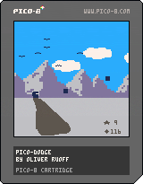

# Pico-Dodge
A small Pico-8 game, based on an android game I coded in university during a 48h hackathon.

## Cardridge 

> Note to me: Cardridge picture can be taken by pressing F2 while playing
## Changelog

### 2024-01-13
- Added ducking animation
- Added jumping animation
- Added walking animation
- Added down press
- Added player jump physics

### 2024-01-12
- Switched to player dict
- Added floor
- Added player as a rectfill